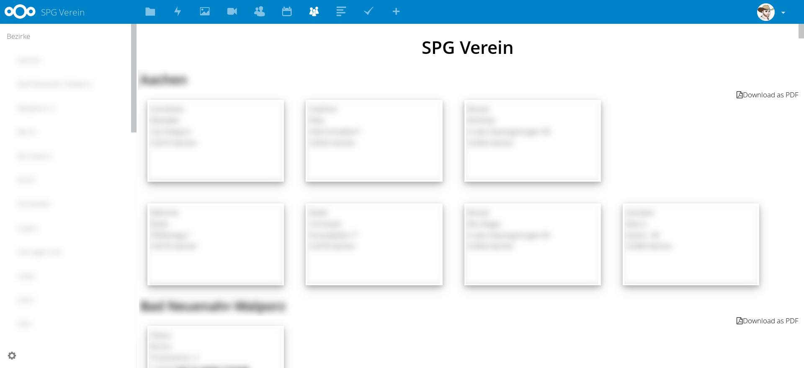

# SPG Verein

[SPG-Verein](https://spg-direkt.de/spg-schulungen/spg-verein.html) is a windows program for managing club members. For example, this program supports a club to generate direct debits. The nextcloud app *spgverein* implements additional behaviour for the club. 

- [x] Download address lists as PDF to print them on labels
- [ ] Provide all members as contacts in the addressbook
- [ ] Provide all member birth dates in the calendar

## Screenshots

## Installation

Place this app in **nextcloud/apps/**

