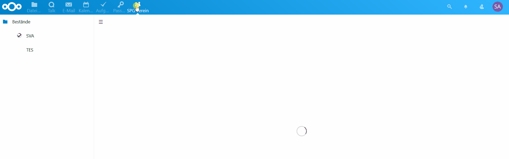

# SPG Verein

[SPG-Verein](https://spg-direkt.de/) is a proprietary windows program for managing club members. For example, this program supports a club to generate direct debits. The nextcloud app *spgverein* implements additional behaviour for the club. 

- [x] Web-Interface to view all members of the club
  - [x] Access the member attachments
- [x] Download address lists as PDF to print them on labels
- [x] Export members as ODS file
- [ ] Provide all members as contacts in the addressbook
- [ ] Provide all member birth dates in the calendar
- [x] Support of SPG-Verein version 3
- [ ] Support of SPG-Verein version 4

## Screenshots

## Usage

Install the Nextcloud app [*spgverein* from the app store](https://apps.nextcloud.com/apps/spgverein) and synchronize the folder that contains the files that end with `*mitgl.dat`. Then, you will be able to access your club members in the Nextcloud UI.
